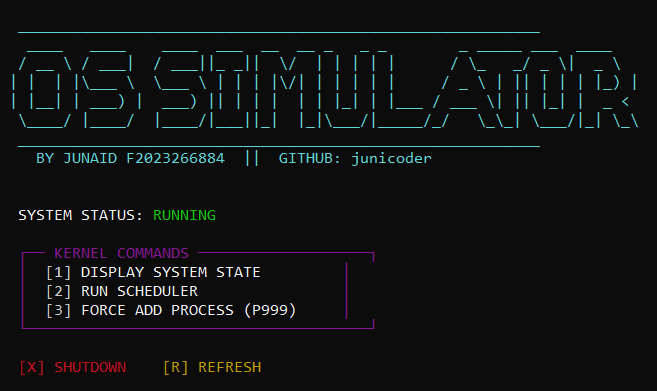
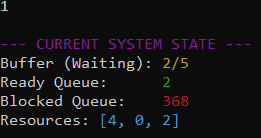
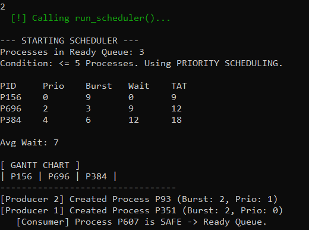
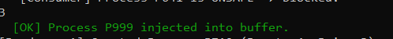

# 🖥️ Mini OS Simulator

### **Developed by: Muhammad Junaid**

**ID:** F2023266884

**GitHub:** [junicoder](https://github.com/junicoder)

---

## 📖 Project Overview

This project is a command-line based **Mini OS Simulator** designed as a Complex Computing Problem (CCP) for the Operating Systems Lab. It integrates core operating system concepts including CPU scheduling, concurrent task management, and deadlock prevention into a single, modular system.

The simulator models a realistic environment where processes are dynamically generated, synchronized through a bounded buffer, and checked for resource safety before execution.

---

## 🛠️ System Architecture

The simulator is built on three cooperating modules:

**Part A: Process Scheduling Module (40%)** 

Handles CPU scheduling using two distinct algorithms based on system load:

* **Priority Scheduling (Non-preemptive):** Activated when there are  ready processes.


* **Round Robin Scheduling (Preemptive):** Activated when there are  ready processes.


* **Outputs:** Gantt Chart, Waiting Time, Turnaround Time, and Average Statistics.


**Part B: Producer-Consumer Module (30%)** 

Manages concurrent process entry into the system:

* **Concurrency:** Utilizes two producer threads and one consumer thread.


* **Synchronization:** Implements semaphores (`empty_slots`, `full_slots`) for buffer management and a `mutex_lock` for mutual exclusion to prevent race conditions.


* **Efficiency:** strictly avoids busy waiting by utilizing POSIX synchronization primitives.


**Part C: Deadlock Prevention (30%)** 

Ensures the system remains in a "Safe State" using a simplified **Banker’s Algorithm**:

* **Resource Management:** Tracks Max, Allocation, and Available resource vectors.


* **Safety Check:** Every process fetched from the producer-consumer buffer is analyzed; if granting resources leads to an unsafe state, the process is moved to a **Blocked Queue**.


---

## 🚀 Features & UI

The interface provides a professional CLI experience with:

* **Dynamic ASCII Header:** High-contrast display with developer credentials.
* **Real-time Monitoring:** View the status of the Bounded Buffer, Ready Queue, and Blocked Queue.
* **Manual Intervention:** Ability to manually inject processes (P999) to test system behavior.
* **Thread Safety:** Clean shutdown sequence that cancels threads and destroys semaphores/mutexes safely.

---

## 📸 Screenshots

> **Menu**

> 

> **1 . Display System State**

> 

>**2 . Run Scheduler**

> 

>**3 . Force add process (P999)**

> 
---

## 💻 Compilation & Execution

The project is optimized for **Ubuntu WSL** and requires the `build-essential` package.

### **Prerequisites**

```bash
sudo apt update
sudo apt install build-essential g++

```

### **Building the Simulator**

Compile the modular source files using the following command:

```bash
g++ modules.cpp main.cpp -o os_sim -lpthread

```

*Note: The `-lpthread` flag is essential for linking the POSIX threads library used in the project.*

### **Running the Application**

```bash
./os_sim

```

---

## 📂 File Structure

* `os_sim.h`: Shared definitions, structures, and function prototypes.
* `main.cpp`: Entry point containing the CLI menu and thread initialization.
* `modules.cpp`: Core logic implementation for the Scheduler, Banker's Algorithm, and Producer-Consumer threads.

---

## 🛑 Limitations & Future Scope

* **Current Limit:** The simulator is currently text-based.
* **Future Expansion:** Potential to expand into a GUI-based OS Simulator or a Cloud Workload Scheduler for a Final Year Project (FYP).
